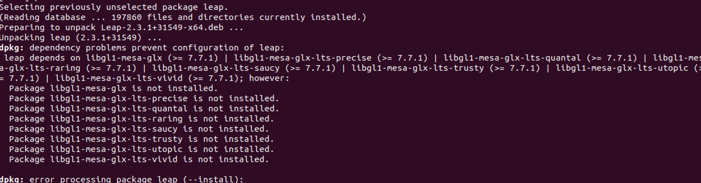

# Installation on RaspberryPi 3

*N.B. This section is for developers only!*

- [Python 3.8]( https://linuxize.com/post/how-to-install-python-3-8-on-ubuntu-18-04/?utm_content=cmp-true);
  - numpy 1.24.3;
  - pandas 2.0.2;


## How to install Leap Developer Kit 2.3.1+31549

1. Download the kit from this [link](https://www2.leapmotion.com/v2-developer-beta-linux).
2. In your terminal execute the following instructions.
    ```
    sudo dpkg--install Leap-2.3.1+31549-×64.deb
    ```
   
    If you got this error use the following command.

    <p align="center"></p>
    
   ```
    sudo apt-get install libgl1-mesa-glx
    ```
4. Start the daemon using the following command.
    ```
    sudo leapd
    ```
   
    To use GUI run in another terminal:
    ```
    LeapControlPanel
    ```
   

## Configure the LeapMotion SDK to work with Python3.8 [link](https://forums.leapmotion.com/t/leap-motion-sdk-with-python-3-5-in-linux-tutorial/5249/7)
1. Create a new folder `MarcoSmiles5.0` in the folder `LeapSDK` of the Leap Developer Kit.
2. Copy the libraries and a sample scripts in the  `MarcoSmiles5.0` folder.
    ```
   cp -a lib/x64/libLeap.so lib/Leap.py samples/Sample.py MarcoSmiles5.0/
    ```
3. Install some necessary packages.
    ```
   sudo apt-get install swig g++ libpython3.8-dev
    ```
4. Download the patch file and apply it.
    ```
    wget http://tinyurl.com/leap-i-patch -O Leap.i.diff
    ```
   ```
    patch -p0 < Leap.i.diff
    ```
5. Create the interface between C++ and Python.
   ```
    swig -c++ -python -o /tmp/LeapPython.cpp -interface LeapPython include/Leap.i
    ```
6. Compile the library.
   ```
   g++ -fPIC -I/usr/include/python3.8 -I./include /tmp/LeapPython.cpp lib/x64/libLeap.so -shared -o MarcoSmiles5.0/LeapPython.so
    ```
7. You can run any Python file placed in MarcoSmiles5.0 in this way.
     ```
    LD_PRELOAD=./libLeap.so MarcoSmiles5.0 Sample.py
     ```